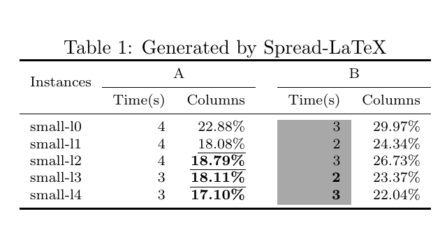

<h1 align = "center"> <a href="https://gsuite.google.com/marketplace/app/spreadlatex/218144906748">Spread-LaTeX</a></h1>

 Latest update (October 14, 2019) 

A simple add-on for converting a Google spreadsheet table to a LaTeX table or a LaTeX table to a Google Spreadsheet table.

  &nbsp;&nbsp;&nbsp;&nbsp;&nbsp; 

<b> Description:</b>
  

It is rather painful to migrate information from a spreadsheet table to LaTeX or restore a spreadsheet table from LaTeX.  
Spread-LaTeX add-on is built to solve this problem. It simply contains two functions: 
convert a selected Google Spreadsheet table to a LaTeX table and convert a LaTeX table to a Google Spreadsheet table.

====================<b><i> How to use Spread-LaTeX? </i></b>===================== 
Click <a href="https://youtu.be/60UTvTIES2E">here</a> for the youtube video.  
Install the add-on:  
(1) open a Google Spreadsheet,  
(2) click "Add-ons" ---> "Get add-ons" ---> search "Spread-LaTeX" and install.  

Convert a spreadsheet table to LaTeX:  
(1) select a table in a Google Spreadsheet,   
(2) click "Add-ons" ---> "Spread-LaTeX" ---> "Convert sheet->LaTeX",   
(3) a window will popup, type in the total number of rows for column names and click "OK",   
(4) select all the generated LaTeX code (e.g. Ctrl + A) and copy (e.g. Ctrl + C).  

Convert a LaTeX table to a spreadsheet table: 
(1) copy the LaTeX code between \toprule and \bottomrule of a table and paste it to any place in a Google spreadsheet,  
(2) click "Add-ons" ---> "Spread-LaTeX" ---> "Convert LaTeX->sheet",  
<b><i>\*Errors may occur if the LaTeX table was not generated by Spread-LaTeX.</i></b> 

=========================<b><i> Settings </b></i>=========================== 

(1) Package {booktabs} is used for borders.  
(2) Package {xcolor} is used for cell colours.  
(3) Package {soul} is used for underlines.  
(3) Environments {tabular} and {table} are used.  
(4) Each "%" is replaced with "\\%". Each"\_" is replaced with "\\_" only if there is no "$" in the cell. 
The rest special LaTeX chars remains intact, given that they may not be plain text. 
For example, $x$ may be a mathematical notation.  
(5) For the purpose of simplicity, this add-on only reads the following information from a spreadsheet table: 
<i> the data, data formats, highlights, font weights, underlines and merged ranges.</i>  
(6) Tables’ configurations such as alignments and borders are generated via the code using a default setting. 
\==================================================================

I enthusiastically welcome suggestions. 

<h3>Privacy Policy:</h3>

I (“Spread-LaTeX”, “I”, “me” or “my”) understand that privacy is essential to the users of my product (“users”, “you”, “your”). This policy describes the steps I take to maintain your privacy when you are using my G Suit add-on (“Service”, "Spread-LaTeX"). By using my Service, you agree to the collection and use of information in accordance with this policy. 

1. Data collection and use: 
The purpose of the Service is to provide a smooth connection between LaTeX and Google Spreadsheet. Therefore the Service only collects the data that is related to the Service's functions --- convert LaTeX->sheet and convert sheet->LaTeX. I do not record any data from the users. 
 
2. What do I do with your data?  
The collected data is only used for (1) generating a LaTeX table, or (2) spreadsheet table.  

3. What are the required Add-on authorization scopes?  
https://www.googleapis.com/auth/script.container.ui 
https://www.googleapis.com/auth/spreadsheets

<h3>Terms of Service:</h3>

Thank you for being interested in the Spread-LaTeX add-on ("Service"). Please carefully review the terms outlined below before using the Service. 

The Terms of Service, Privacy Policy and other content of this document may be updated to reflect changes to the Service. Upon making changes, I will update the “Latest update” found at the top of this document. Your continued use of the Service after any changes constitutes your acceptance of the new terms.

<b>If you do not agree with these terms and conditions, you must not use the Service.</b> 

1. Using the Service  
The Service requires a Google account that will be used to access and use the Service. You understand and acknowledge that you are solely responsible for obtaining the internet access and all equipment necessary to use the Service, for appropriately configuring your Google account and for creating and managing the data source and their content. 
I reserve the right to change, suspend, or discontinue any part of the Service for any reason without notice. 

2. Google Chrome Store  
Use of the CloudLab Add-ons is subject to <a href="https://gsuite.google.com/terms/marketplace/tos.html?hl=en" > G Suite Marketplace Terms of Service</a>.  
I am a developer subject to <a href = "https://developers.google.com/gsuite/marketplace/requirements">the G Suite Marketplace Application Requirements </a>.  
The Spread-LaTeX add-on is examined to ensure it meets Google’s guidelines, including guidelines for safeguarding user data, before they are publicly available. For more information, see <a href ="https://developers.google.com/gsuite/add-ons/concepts/addon-review"> add-on review </a>.

3. Disclaimer  
The Service is free of charge. Further, while I am making every effort to ensure its functionality, the Service I develop exists within a fast-moving product ecosystem in which things break and may need to be fixed from time to time. I enthusiastically welcome all users of the Service as partners in its development and refinement, but I ask that you engage with me with the following norms when seeking my support: 
(1) The Service is provided on an “as is” and “as available” basis. 
(2) I do not warrant that the content generated by the Service is accurate, reliable or correct; that the Service will meet your requirements; that the Service will be available at any particular time or location, uninterrupted; that any defects or errors will be corrected; or that the Service is free of viruses or other harmful components. 
(3) Use of the Service is at your own risk and I will not responsible for any damage to your computer system or loss of data that results from your use of the Service.

4. Copyright  
Spread-LaTeX add-on is original and owned by me and protected by international copyright, and other intellectual property or proprietary rights laws. 
 
<h3>Developer: <a href="https://sites.google.com/view/zhuyihang/home"> Yi-Hang Zhu</a> </h3>
